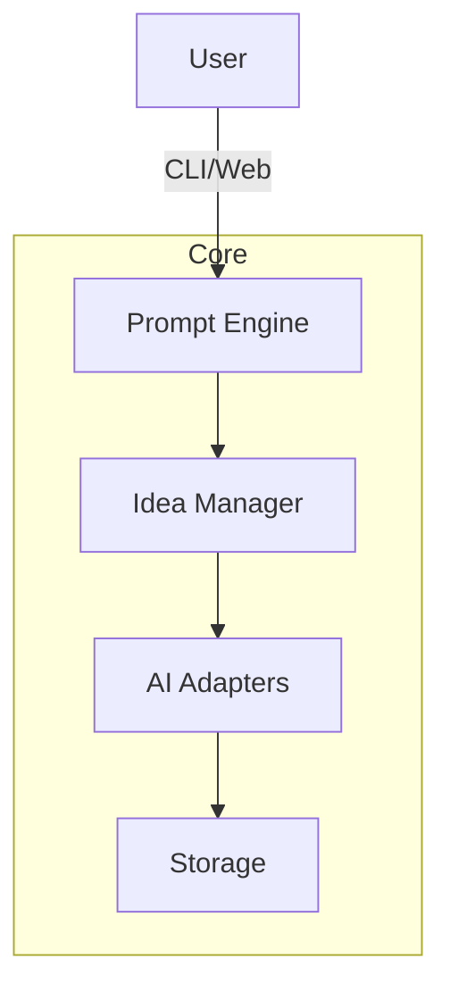
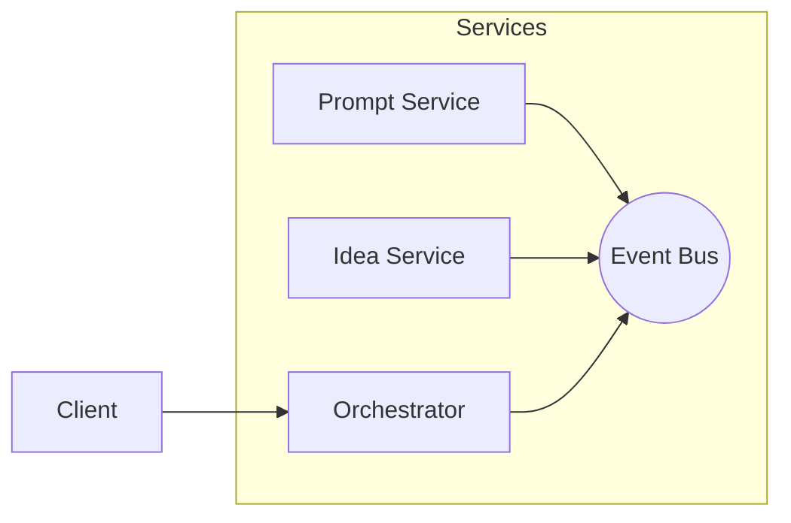
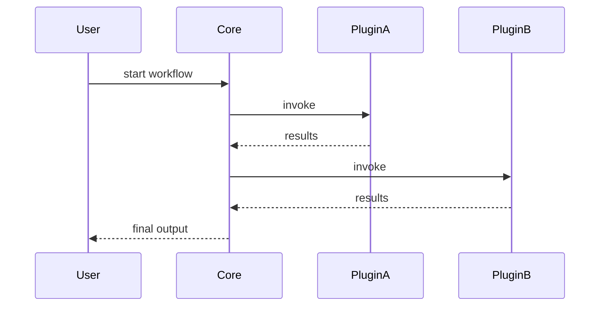

# Crucible High-Level Architecture Options

Crucible is envisioned as an ecosystem for brainstorming, idea generation, and prompt creation. The system is still speculative, so the scope and responsibilities are open for exploration. Below are several possible approaches to structuring the project.

## Option A: Modular Monolith

- **Core Library**: A Python package providing core abstractions for prompts, idea snippets, and orchestration logic.
- **Extension Modules**: Each area (e.g., prompt templates, AI agent adapters, storage) lives in its own module under a common package namespace.
- **Single Deployment Target**: Everything runs in a single process (CLI or web app) but is organized into clear domains.

### Pros
- Simple deployment and easier to reason about.
- Encourages strong domain boundaries via modules.

### Cons
- Scaling and experimentation are limited to one runtime environment.

## Option B: Microservice-Oriented

- **Services**: Independent services for prompt generation, idea management, and orchestration.
- **Message Bus**: Services communicate via an event bus (e.g., RabbitMQ or Redis streams).
- **Client SDK**: Lightweight Python SDK wraps API calls and message handling.

### Pros
- Clear separation of responsibilities and scaling per service.
- Allows polyglot implementations if desired.

### Cons
- Higher operational complexity.
- Might be overkill if the domain remains small.

## Option C: Plugin-Based Core

- **Core Engine**: Small kernel responsible for loading plugins and managing workflow execution.
- **Plugins**: Self-contained packages that implement prompt templates, connectors to AI models, or export formats.
- **Configuration**: End users assemble a stack of plugins via config files.

### Pros
- Easy to extend with new capabilities.
- Encourages experimentation with minimal changes to core.

### Cons
- Harder to enforce consistent design across plugins.

## Next Steps
We can experiment with a small modular monolith first (Option A) while designing the architecture to allow future extraction into services or plugins as the project matures.
